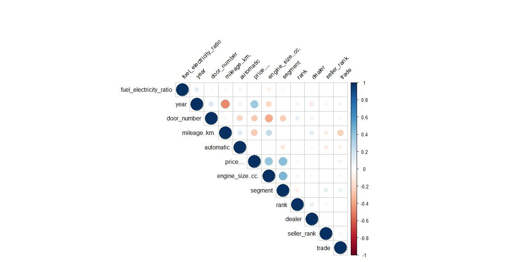
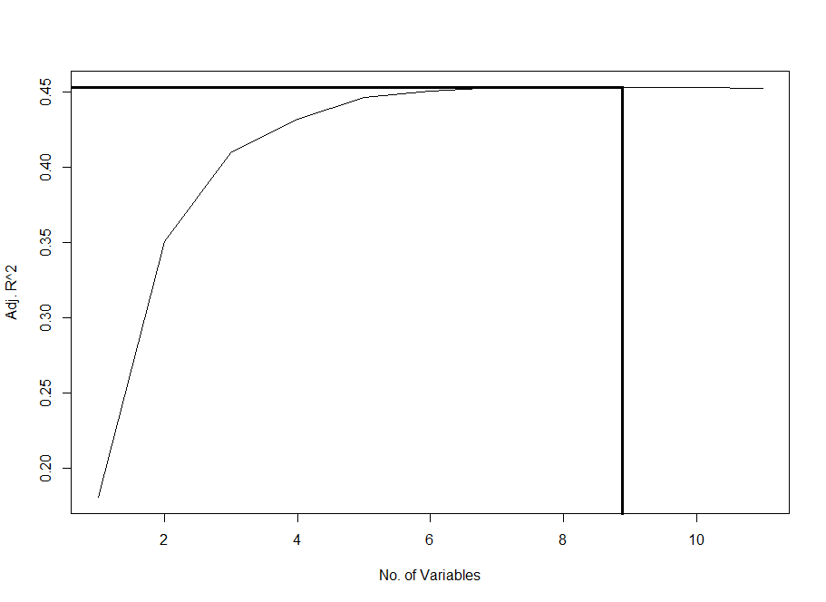
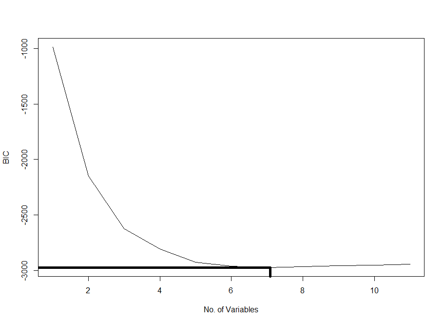

# python_web_scraper

This was a project created for submission for the 2019 Microsoft Student Accelerator program, and was entirely for educational purposes only.

This involved web scraping data from a site and visualising the data on PowerBI and presenting this in person to the Microsft Student Partners.

The jupyter notebook contains a web scraper that uses python and BeautifulSoup to extract 15,000 car listings and their data that were offered for sale on Autotrader at the time into a csv file "output-test-15000.csv".

As the full notebook is too large to display on github, another notebook "car sales data scraper first page data only.ipynb" which only scraped listings from the first page of Autotrader is included to be viewed.

This data was then put into PowerBi to create data visulisations which are contained in the otherwise identical pbix, ppt and pdf files.

The presentation slides contain some further visualisation of data and trends of the listings.


Below is a summary of my presentation <br/><br/>

**Business problem you are aiming to solve and relevant assumptions**

So if you want to be a car dealer in New Zealand, you might wonder what factors about a car will influence its selling price?
Well naturally you would expect a newer BMW would cost more than an older Datsun, but how important is this compared to other factors, such as where the seller is, on if it has any significant impact on the asking price?

So to investigate this, I decided to web scrap https://www.autotrader.co.nz/ 

I used Autotrader's search by popularity so that I could also generate a popularity variable as determined by a cars page and its page rank similar to that of the example given in the training day. I will be assuming that Autotraders page rank is accurate representation of popular cars.
Also I am presuming that searching by popularity will capture a representative sample of vehicles sold and bought in New Zealand, as opposed to unpopular cars that sit on dealer lots unsold, presumably due to factors such as poor condition or an unrealistic asking price.

**An explanation of your analysis.**

I trawled through 750 pages from Autotrader each with 20 listings, to produce a data set with about 15,000 cars, which you may see in car sales test.ipynb. The code was based on the example from the training day with some modification.
I also scraped the following details from each listing:

<br/><br/>
<ul>
<li>Year</li>
<li>Brand</li>
<li>Model</li>
<li>Price</li>
<li>Mileage </li>
<li>Number of doors</li>
<li>Bodystyle</li>
<li>Colour</li>
<li>Engine size</li>
<li>Transmission</li>
<li>Fuel used</li>
<li>Type of seller - dealer or private</li>
<li>Location of seller</li>
<li>Page it was listed on</li>
<li>Its rank on the page it was listed on</li>
<li>link to the cars listing - helpful for debugging</li>
</ul>

Oddly for 3 pages, it seemed to stall for some reason and so I ended up with 60 less cars than what with what should have come from those pages. However this should not have been significant as there were still 14940 results left.

With the results, some cars do not advertise an asking price so I removed these. As there were 52 such cars, I also did not believe this will have any material impact on the results.

I then created pair plots to see if there were any trends, skews, or outliers. Due to the number of variables, a large number of pairplots was created, so only the ones of interest were shown, with the rest are in the pair plots folder.

Immediately obvious trends included that year and price have a positive exponential trend.
The inverse was true of mileage and price. 
Also whilst the newest vehicles had the lowest mileages, the mileage increased for earlier models only up to a point before there was no clear trend.

<br/><br/>
<br/><br/>
<br/><br/>

The pair plots revealed that there were some very interesting cars including an Isuzu from the year 2301 and a BMW with 52 doors which I decided to exclude.
<br/><br/>
<br/><br/>

Some cars were listed with other incorrect features such as unrealistically small or big engine sizes (engines with less than 500cc or more than 9000cc),  which were obviously listed incorrectly. As a number of electric cars (which have no internal combustion engine) were listed as such, I converted those engine values to 'NA'.
Also some cars were listed as being a one door, where upon investigation it seemed that were incorrectly listed. The same goes for the three listings that had 6 and 7 doors. These were also excluded.
The most expensive listing by far away was a Mclaren Senna worth nearly 2 million dollars. Whilst this was not an unfair asking price, as a type of car that rarely saw the market, it was also excluded as well.

<br/><br/>

In addition to the prior mentioned trends, the correlation charts also revealed that door numbers was negatively correlated with price and engine size. Also engine size was positively correlated with price. As some variables were not numerical, they were converted into dummy variables to see if there were any correlation. This will be explained further in the next part. Trade vehicles were more likely to have a higher mileage. However overall there were no very strong correlations that warrented removing of variables.

<br/><br/>

The code used to remove rows of data is in clean.r

**An explanation of the model selection criteria you used and a comparison between the model results and your assumptions.**

Categorical variables will first have to be converted to dummy variables, as otherwise in model selection, every single individual factor of each categorical variable seemed to be treated as a seperate factor. E.g. for the brand categorical factor, it would look at whether a listing was an Audi or not, whether a listing was an BMW or not, thus producing many variables. With the many different brands, models, etc. With such many variables, it produced long running times and used up all the memory, thus requiring conversion to dummy variables.

The following is what was done in dummyvariables.r
<ul>
  <li>
    I created a market segment variable which segments brands based on their average asking price, and assigned this on a scale of 0 to 6 to each listing. I calculated the average asking price based on asking prices of cars produced since 2013. As expensive cars tended to depreciate proportionally much more then cheaper ones, I chose to only use prices of more recent cars. However only using cars of the last couple of years did not change how cars fell into segments, but excluded some less common car brands still in production, so I chose not to do this. The few remaining cars in a niche segment were given a segment value of N/A
  </li>
   
  <li>
As there were hundreds of models, this would not be easy to quantify, so I ignored this variable. They were almost all mutually exclusive of their brand anyway.
  </li>
  
  <li>
Fuel type was factorised where pure fuel vehicles were rated 0, hybrids 0.5 and electric 1
  </li>
  
  <li>
Bodystyles was also not easy to quantify, for some styles, they would tend to consistently have the same number of doors, e.g. coupes have 2 doors, and a sedan has four, whilst others such as hatchbacks and utes were less consistent. So I quantified this by deciding if look at if they were the sort of vehicles likely to be used by those in trade, e.g.:
Bodystyle used in trade (value 0)
<ul>
<li>People Mover</li>
<li>Small Truck</li>
<li>Van And Minivan</li>
<li>Ute</li>
<li>Wagon</li>
</ul>
Bodystyle not used in trade (value 1)
<ul>
<li>4x4 </li>
<li>Coupe</li>
<li>Convertible – missing</li>
<li>Hatchback</li>
<li>Sedan</li>
<li>Suv</li>
</ul>
  </li>
  
  <li>
Transmission was quantified were the various types of automatic transmissions (automatic, CVT and tiptronic) were grouped into the value of 0, whilst manual transmissions was given the value of 1
  </li>
  
  <li>
Colour was attempted to be quantified by for example grouping into whther they were hot or cold colours of light or dark colours or using their RGB values. However as these did not produce any significant results, as well as cars all having different shades of the colour they are listed as compared to each other, I did not attempt this any further.
  </li>
  
  <li>
Seller type was quantified by a simple conversion to a binary 0 for dealer and 1 for private seller
  </li>
  
  <li>
Seller location was quantified by grouping together based on the population sizes of the seller locations using the 2018 data at https://www.stats.govt.nz/information-releases/subnational-population-estimates-at-30-june-2018-final-nz-stat-tables
  </li>
</ul>

Variable subset selection can be done using functions from the leaps library. 
This helps determine the best model with number of variables present by determining the Cp, adjusted r squared and BIC values. This will look at the variables: year, mileage..km., door_number, engine_size..cc., rank, segment, fuel_electricity_ratio, trade, automatic, dealer, seller_rank. 

Using the code in model_selection.r, we produce the following plots for adjusted r squared, Cp, and Bayesian Information Criterion:
<br/><br/>
<br/><br/>
<br/><br/>

The adjusted r squared gives 9 variables as the optimal model, whilst the other two give 7.

The plot.regsubsets method was used to see which variables to use by plotting the regsubsets object.

<br/><br/>
<br/><br/>
<br/><br/>

For both adjusted r squared and bic, it seemed to level out for different number of combinations of variables, however for cp, the lowest value of 7.7 was acheived with just one combination of seven variables: year, mileage, door number, engine size, brand market segment, whether it had an automatic and the scale of the cars location's population size.

As this combination of seven variables was also one of the combinations used to achieve the highest/lowest values for adjusted r squared and bic respectively, these will be the variables used in the model selection. 

We can generate a matrix of the 7 best models which shows which variables are included in each of the models. Models are Such variables are indicated by asterisks, variables not included are empty. 
We can also use forward, backward and stepwise selection in generating the models. Forward selection starts with no variables and adds a variable until no statistcal difference is made. Backward selection starts with all variables and removes a variable until no statistcal difference is made. In stepwise selection, it also starts with no variables and adds a variable to the model. However after each variable is added, variables that make no statistical significance are also removed until no statistcal difference is made.


The results show the same 7 variables were chosen.

```r
> ret.full.fwd <- regsubsets(price....~.,data=numcars2,nvmax=7,method='forward')
> summary(ret.full.fwd)
Subset selection object
Call: regsubsets.formula(price.... ~ ., data = numcars2, nvmax = 7, 
    method = "forward")
11 Variables  (and intercept)
                       Forced in Forced out
year                       FALSE      FALSE
mileage..km.               FALSE      FALSE
door_number                FALSE      FALSE
engine_size..cc.           FALSE      FALSE
rank                       FALSE      FALSE
segment                    FALSE      FALSE
fuel_electricity_ratio     FALSE      FALSE
trade                      FALSE      FALSE
automatic                  FALSE      FALSE
dealer                     FALSE      FALSE
seller_rank                FALSE      FALSE
1 subsets of each size up to 7
Selection Algorithm: forward
         year mileage..km. door_number engine_size..cc. rank segment fuel_electricity_ratio trade
1  ( 1 ) " "  " "          " "         " "              " "  "*"     " "                    " "  
2  ( 1 ) "*"  " "          " "         " "              " "  "*"     " "                    " "  
3  ( 1 ) "*"  " "          " "         "*"              " "  "*"     " "                    " "  
4  ( 1 ) "*"  "*"          " "         "*"              " "  "*"     " "                    " "  
5  ( 1 ) "*"  "*"          "*"         "*"              " "  "*"     " "                    " "  
6  ( 1 ) "*"  "*"          "*"         "*"              " "  "*"     " "                    " "  
7  ( 1 ) "*"  "*"          "*"         "*"              " "  "*"     " "                    " "  
         automatic dealer seller_rank
1  ( 1 ) " "       " "    " "        
2  ( 1 ) " "       " "    " "        
3  ( 1 ) " "       " "    " "        
4  ( 1 ) " "       " "    " "        
5  ( 1 ) " "       " "    " "        
6  ( 1 ) "*"       " "    " "        
7  ( 1 ) "*"       " "    "*"        
```

```
> ret.full.fwd <- regsubsets(price....~.,data=numcars2,nvmax=7,method='backward')
> summary(ret.full.fwd)
Subset selection object
Call: regsubsets.formula(price.... ~ ., data = numcars2, nvmax = 7, 
    method = "backward")
11 Variables  (and intercept)
                       Forced in Forced out
year                       FALSE      FALSE
mileage..km.               FALSE      FALSE
door_number                FALSE      FALSE
engine_size..cc.           FALSE      FALSE
rank                       FALSE      FALSE
segment                    FALSE      FALSE
fuel_electricity_ratio     FALSE      FALSE
trade                      FALSE      FALSE
automatic                  FALSE      FALSE
dealer                     FALSE      FALSE
seller_rank                FALSE      FALSE
1 subsets of each size up to 7
Selection Algorithm: backward
         year mileage..km. door_number engine_size..cc. rank segment fuel_electricity_ratio trade
1  ( 1 ) " "  " "          " "         "*"              " "  " "     " "                    " "  
2  ( 1 ) "*"  " "          " "         "*"              " "  " "     " "                    " "  
3  ( 1 ) "*"  " "          " "         "*"              " "  "*"     " "                    " "  
4  ( 1 ) "*"  "*"          " "         "*"              " "  "*"     " "                    " "  
5  ( 1 ) "*"  "*"          "*"         "*"              " "  "*"     " "                    " "  
6  ( 1 ) "*"  "*"          "*"         "*"              " "  "*"     " "                    " "  
7  ( 1 ) "*"  "*"          "*"         "*"              " "  "*"     " "                    " "  
         automatic dealer seller_rank
1  ( 1 ) " "       " "    " "        
2  ( 1 ) " "       " "    " "        
3  ( 1 ) " "       " "    " "        
4  ( 1 ) " "       " "    " "        
5  ( 1 ) " "       " "    " "        
6  ( 1 ) "*"       " "    " "        
7  ( 1 ) "*"       " "    "*"        
```

```
> ret.full.fwd <- regsubsets(price....~.,data=numcars2,nvmax=7,method='seqrep')
> summary(ret.full.fwd)
Subset selection object
Call: regsubsets.formula(price.... ~ ., data = numcars2, nvmax = 7, 
    method = "seqrep")
11 Variables  (and intercept)
                       Forced in Forced out
year                       FALSE      FALSE
mileage..km.               FALSE      FALSE
door_number                FALSE      FALSE
engine_size..cc.           FALSE      FALSE
rank                       FALSE      FALSE
segment                    FALSE      FALSE
fuel_electricity_ratio     FALSE      FALSE
trade                      FALSE      FALSE
automatic                  FALSE      FALSE
dealer                     FALSE      FALSE
seller_rank                FALSE      FALSE
1 subsets of each size up to 7
Selection Algorithm: 'sequential replacement'
         year mileage..km. door_number engine_size..cc. rank segment fuel_electricity_ratio trade
1  ( 1 ) " "  " "          " "         " "              " "  "*"     " "                    " "  
2  ( 1 ) "*"  " "          " "         "*"              " "  " "     " "                    " "  
3  ( 1 ) "*"  "*"          "*"         " "              " "  " "     " "                    " "  
4  ( 1 ) "*"  "*"          "*"         "*"              " "  " "     " "                    " "  
5  ( 1 ) "*"  "*"          "*"         "*"              "*"  " "     " "                    " "  
6  ( 1 ) "*"  "*"          "*"         "*"              " "  "*"     " "                    " "  
7  ( 1 ) "*"  "*"          "*"         "*"              " "  "*"     " "                    " "  
         automatic dealer seller_rank
1  ( 1 ) " "       " "    " "        
2  ( 1 ) " "       " "    " "        
3  ( 1 ) " "       " "    " "        
4  ( 1 ) " "       " "    " "        
5  ( 1 ) " "       " "    " "        
6  ( 1 ) "*"       " "    " "        
7  ( 1 ) "*"       " "    "*"        
```

On the other hand autotraders popularity ranking seemed to have no influence on price at all. Perhaps popularity does not translate readily into price, or maybe Autotraders page rank is not an accurate representation of popular cars.


**A Conclusion with your answer to the business problem**

So the factors that have the most impact on a cars listing price are: year, mileage, door number, engine size, brand market segment, whether it had an automatic transmission and the scale of the cars location's population size.
